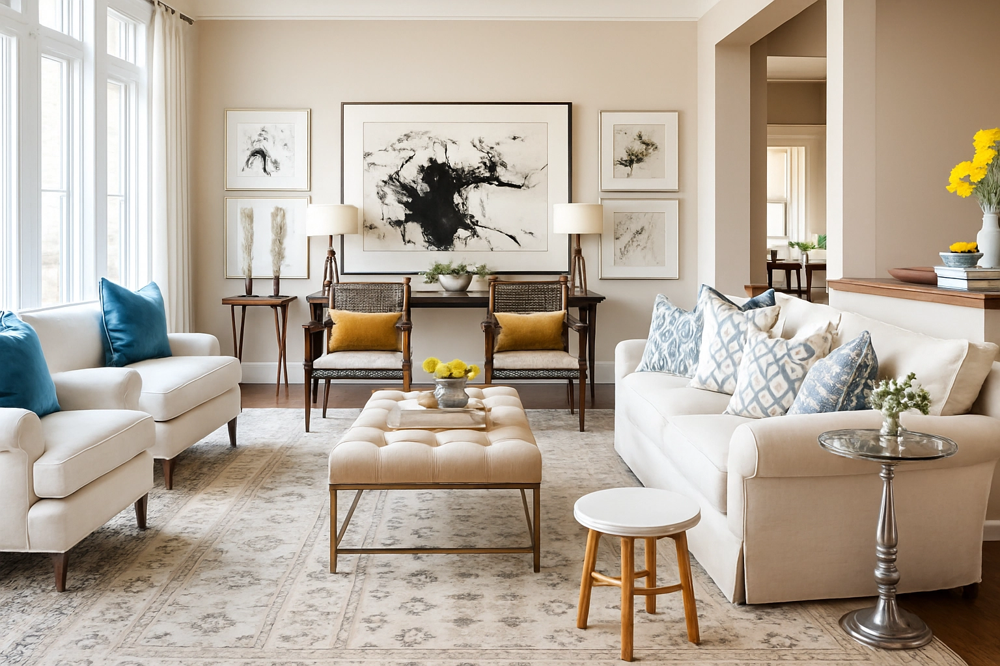
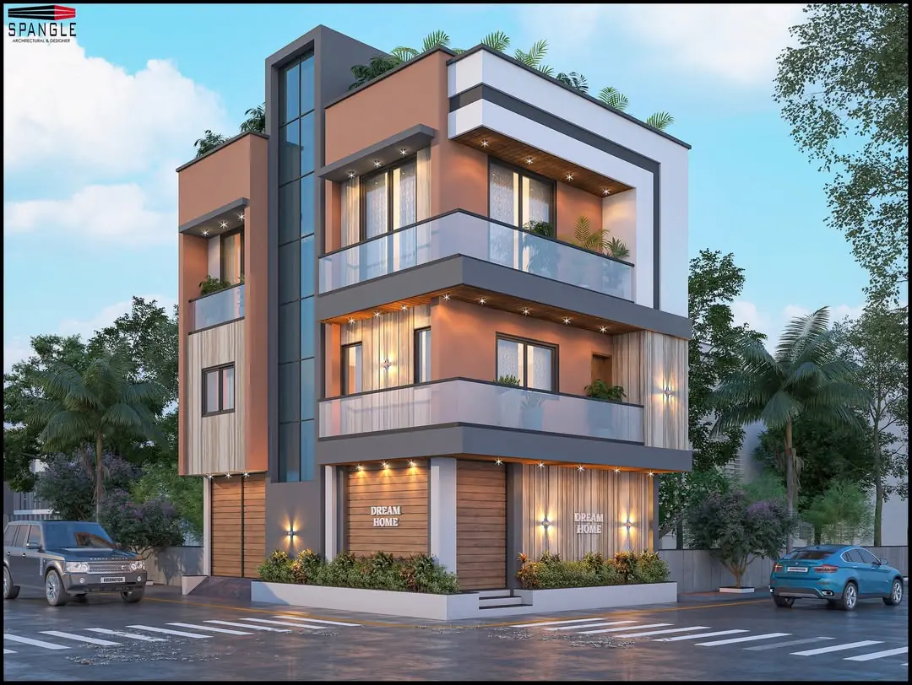
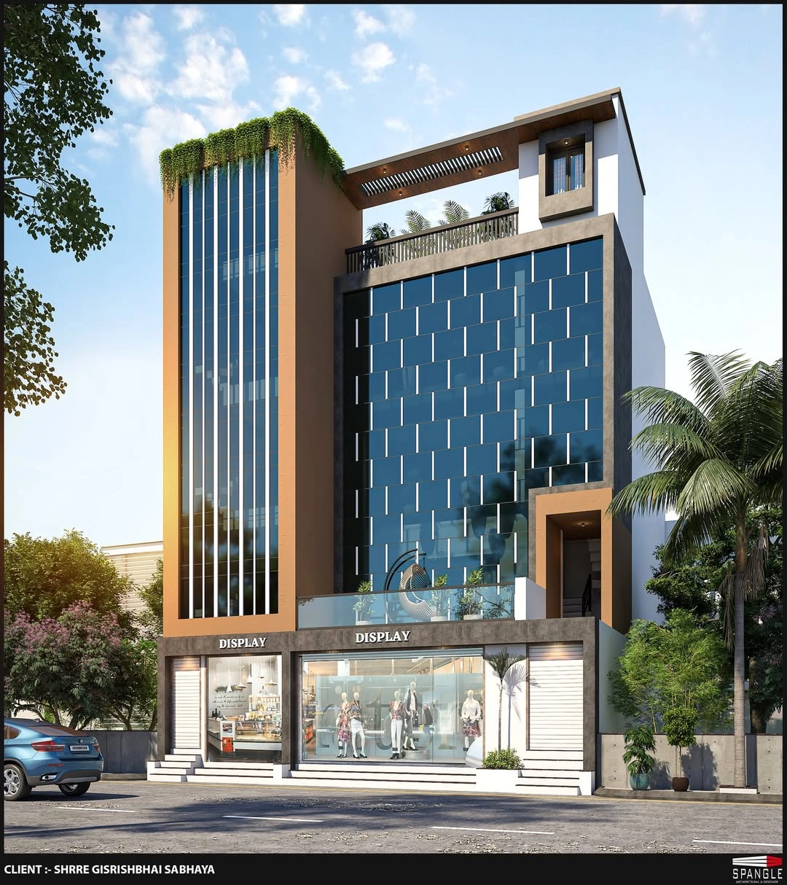

<html lang="en">
<head>
  <meta charset="UTF-8" />
  <meta name="viewport" content="width=device-width, initial-scale=1" />
  <title>SPANGLE | Architectural & Interior Design</title>
  <meta name="description" content="SPANGLE is a premium architecture & interior design studio crafting timeless residential, commercial, and luxury spaces.">
  <meta property="og:title" content="SPANGLE | Architecture & Interior Design Studio" />
  <meta property="og:description" content="Explore SPANGLE’s world-class architecture and interior design projects tailored to modern living." />
  <meta property="og:type" content="website" />
  <meta property="og:image" content="spangle-cover.webp" />
  <meta property="og:url" content="https://yourwebsite.com" />
  <link rel="icon" href="favicon.ico" type="image/x-icon" />
  <link href="https://fonts.googleapis.com/css2?family=Poppins:wght@400;600&display=swap" rel="stylesheet"/>
  <link rel="stylesheet" href="https://cdnjs.cloudflare.com/ajax/libs/font-awesome/6.5.0/css/all.min.css"/>
  <link rel="stylesheet" href="style.css"/>
</head>

<body>
  <!-- Header -->
  <header class="main-header transparent" role="banner" id="site-header" style="--header-height:92px;">
    

      

        
        

          <h1 class="brand-title">SPANGLE</h1>
          
Architectural & Interior Design Studio

        

      

      <nav class="navbar" role="navigation" aria-label="Main navigation">
        

          <i class="fas fa-bars" aria-hidden="true"></i>
        

        <ul class="nav-links desktop-nav" role="menubar">
          <li role="none"><a role="menuitem" href="#">Home</a></li>
          <li role="none"><a role="menuitem" href="#about">About</a></li>
          <li role="none"><a role="menuitem" href="#services">Services</a></li>
          <li role="none"><a role="menuitem" href="#projects">Projects</a></li>
          <li role="none"><a role="menuitem" href="#blog">Blog</a></li>
          <li role="none"><a role="menuitem" href="#contact">Contact</a></li>
        </ul>

        

          
<i class="fas fa-times" aria-hidden="true"></i>

          <ul class="overlay-nav" role="menu" aria-labelledby="mobile-menu">
            <li role="none"><a role="menuitem" href="#">Home</a></li>
            <li role="none"><a role="menuitem" href="#about">About</a></li>
            <li role="none"><a role="menuitem" href="#services">Services</a></li>
            <li role="none"><a role="menuitem" href="#projects">Projects</a></li>
            <li role="none"><a role="menuitem" href="#blog">Insights</a></li>
            <li role="none"><a role="menuitem" href="#contact">Contact</a></li>
          </ul>
        

      </nav>
    

  </header>

  <!-- Hero Slider -->
  <section class="hero-slider" aria-label="Homepage featured images">
    

      <!-- NOTE: ensure these image filenames exist. I corrected 'spankle-' -> 'spangle-' if they were typos -->
      
      
      
      
      <button class="slide-btn prev" id="prev" aria-label="Previous slide">&#10094;</button>
      <button class="slide-btn next" id="next" aria-label="Next slide">&#10095;</button>
    

  </section>

  <!-- Intro Section -->
  <section class="intro-section fade-slide" id="about" tabindex="0" aria-labelledby="intro-title">
    

      

        
      

      

        <h2 id="intro-title" class="intro-title fade-slide">Transforming Spaces with Elegance</h2>
        

          At <strong>SPANGLE</strong>, creativity blends with precision to craft spaces reflecting your identity. From luxury homes to cutting-edge commercial interiors, we design environments that elevate lifestyles.
        

        

          Innovation and meticulous attention to detail bring your vision to reality — spaces that inspire, function, and endure.
        

        <a href="#services" class="intro-btn fade-slide" role="button">Explore Our Expertise</a>
      

    

  </section>

<!-- Why Choose Us Section -->
<section class="why-choose-us-section" id="services" aria-labelledby="why-choose-title">
  

    <h2 id="why-choose-title" class="section-title">Why Choose SPANGLE</h2>
    
Experience the art of architectural perfection and bespoke interiors tailored exclusively for you.

    
    

      

        

          <i class="fas fa-gem"></i>
        

        <h3>Luxury Design Expertise</h3>
        
We craft timeless designs with precision, elegance, and a touch of luxury.

      

      

        

          <i class="fas fa-user-check"></i>
        

        <h3>Client-Centric Approach</h3>
        
Your vision is our blueprint — every decision aligns with your goals.

      

      

        

          <i class="fas fa-clock"></i>
        

        <h3>On-Time Delivery</h3>
        
Our streamlined processes ensure your project stays on schedule.

      

      

        

          <i class="fas fa-tools"></i>
        

        <h3>Impeccable Execution</h3>
        
Every detail is executed to perfection with the highest quality materials.

      

    

  

</section>

  <!-- Featured Projects Section -->
  <section class="featured-projects fade-slide" id="projects" tabindex="0" aria-labelledby="featured-projects-title">
    

      <h2 id="featured-projects-title" class="section-title">Featured Projects</h2>
      

        

          
          

            <h3>Luxury Villa</h3>
            
Ahmedabad | Residential

          

        

        

          
          

            <h3>Corporate Office</h3>
            
Mumbai | Commercial

          

        

        

          
          

            <h3>Modern Bungalow</h3>
            
Surat | Residential

          

        

        

          
          

            <h3>Retail Showroom</h3>
            
Rajkot | Commercial

          

        

      

    

  </section>

  <!-- Design Process Timeline (kept inline styles for now) -->
  <section class="process-timeline-section fade-slide" tabindex="0" aria-labelledby="process-timeline-title" style="max-width:1200px;margin:60px auto; padding: 0 20px;">
    <h2 id="process-timeline-title" class="section-title">Our Design & Build Process</h2>
    

      

        <i class="fas fa-lightbulb" style="font-size:60px; color:#f6772e; margin-bottom:15px;" aria-hidden="true"></i>
        <h3 style="font-weight:700; margin-bottom:10px;">Conceptualize</h3>
        
Collaboration to understand your vision, needs & ambiance desires.

      

      

        <i class="fas fa-pencil-ruler" style="font-size:60px; color:#f6772e; margin-bottom:15px;" aria-hidden="true"></i>
        <h3 style="font-weight:700; margin-bottom:10px;">Design & Plan</h3>
        
Detailed blueprints & 3D models tailored to your needs.

      

      

        <i class="fas fa-hammer" style="font-size:60px; color:#f6772e; margin-bottom:15px;" aria-hidden="true"></i>
        <h3 style="font-weight:700; margin-bottom:10px;">Build & Furnish</h3>
        
Professional construction & premium finishes using quality materials.

      

      

        <i class="fas fa-check-circle" style="font-size:60px; color:#f6772e; margin-bottom:15px;" aria-hidden="true"></i>
        <h3 style="font-weight:700; margin-bottom:10px;">Review & Deliver</h3>
        
Final quality checks to hand over flawless, timeless spaces.

      

    

  </section>

 <section class="testimonials-section" aria-labelledby="testimonials-title">
  

    <h2 id="testimonials-title" class="section-title">What Our Clients Say</h2>

    

      <!-- Client 1 -->
      

        
“

        
        <h4 class="client-name">Sunita Mehra</h4>
        CEO, Mehra Textiles
        

          SPANGLE transformed our home into a masterpiece. Every detail was carefully executed — highly recommended!
        

      

      <!-- Client 2 -->
      

        
“

        
        <h4 class="client-name">Rohit Patel</h4>
        Founder, TechEntrepreneurs
        

          Excellent project management and a beautiful office space creation. Truly professionals who care.
        

      

      <!-- Client 3 -->
      

        
“

        
        <h4 class="client-name">Aarti Sinha</h4>
        Owner, Natura Boutique
        

          Their sustainable design approach and attention to detail elevate every space they touch.
        

      

    

  

</section>

<section class="awards-section" aria-labelledby="awards-title">
  

    <h2 id="awards-title" class="section-title">Awards & Recognition</h2>
    

      Celebrating excellence in design, innovation, and craftsmanship.
    

    

      <!-- Award 1 -->
      

        
        <h4>Gold Award</h4>
        
Luxury Interiors – 2024

      

      <!-- Award 2 -->
      

        
        <h4>Certified Green Building</h4>
        
IGBC – 2023

      

      <!-- Award 3 -->
      

        
        <h4>Best Innovation</h4>
        
Workspace Design – 2023

      

    

  

</section>

  <!-- Team Spotlight -->
  <section class="team-spotlight fade-slide" tabindex="0" aria-labelledby="team-title" style="max-width:1200px; margin: 0 auto 100px auto; padding: 0 20px;">
    <h2 id="team-title" class="section-title">Meet Our Leadership</h2>
    

      

        
        <h3 style="margin-top: 18px; color:#f6772e;">Rajiv Patel</h3>
        
Principal Architect — Visionary of contemporary Indian architecture with over 22 years of trailblazing design.

      

      

        
        <h3 style="margin-top: 18px; color:#f6772e;">Neha Sharma</h3>
        
Design Director — Award-winning interiors specialist, renowned for "spaces that speak."

      

      

        
        <h3 style="margin-top: 18px; color:#f6772e;">Pooja Ghosh</h3>
        
Sustainability Lead — Biophilic design advocate leading all green projects.

      

      

        
        <h3 style="margin-top: 18px; color:#f6772e;">Vikas Chauhan</h3>
        
Project Manager — Execution maestro driving quality and timely delivery.

      

    

  </section>

  <!-- Latest Blog/Insights -->
  <section class="latest-blog fade-slide" tabindex="0" aria-labelledby="blog-title" style="max-width:1200px; margin: 60px auto 100px auto; padding: 0 20px;">
    <h2 id="blog-title" class="section-title">Latest Insights</h2>
    

      <article style="background:#fff; border-radius: 16px; box-shadow: 0 12px 38px rgba(30,42,58,0.1); overflow: hidden; display: flex; flex-direction: column;">
        
        

          <h3 style="color:#f6772e; font-weight:700; margin-bottom: 14px;">Sustainable Architecture Trends 2025</h3>
          
Explore the top eco-friendly design ideas transforming urban spaces.

          <a href="#" style="margin-top: 18px; display: inline-block; font-weight: 700; color: #e25141; text-decoration: underline;">Read more &rarr;</a>
        

      </article>
      <article style="background:#fff; border-radius: 16px; box-shadow: 0 12px 38px rgba(30,42,58,0.1); overflow: hidden; display: flex; flex-direction: column;">
        
        

          <h3 style="color:#f6772e; font-weight:700; margin-bottom: 14px;">Minimalist Interior Design Principles</h3>
          
How to create calm, elegant spaces with minimal yet sophisticated touches.

          <a href="#" style="margin-top: 18px; display: inline-block; font-weight: 700; color: #e25141; text-decoration: underline;">Read more &rarr;</a>
        

      </article>
      <article style="background:#fff; border-radius: 16px; box-shadow: 0 12px 38px rgba(30,42,58,0.1); overflow: hidden; display: flex; flex-direction: column;">
        
        

          <h3 style="color:#f6772e; font-weight:700; margin-bottom: 14px;">Modern Office Spaces That Inspire</h3>
          
Design trends to boost creativity and productivity in corporate environments.

          <a href="#" style="margin-top: 18px; display: inline-block; font-weight: 700; color: #e25141; text-decoration: underline;">Read more &rarr;</a>
        

      </article>
    

  </section>

  <!-- CTA -->
  <section class="cta-contact fade-slide" tabindex="0" style="background: linear-gradient(90deg, #f6772e, #e25141); padding: 70px 20px; text-align: center; color: #fff;">
    <h2 style="font-size: 2.8rem; font-weight: 700; margin-bottom: 20px; max-width:900px; margin-left:auto; margin-right:auto;">
      Ready to Transform Your Space? 
      Let's Create Something Extraordinary Together.
    </h2>
    <a href="contact.html" role="button" style="background:#fff; color:#e25141; font-weight: 700; font-size: 1.4rem; padding: 18px 36px; border-radius: 45px; box-shadow: 0 14px 32px rgba(255,255,255,0.35); text-decoration:none; user-select:none; transition: background-color 0.3s ease, color 0.3s ease;" rel="noopener noreferrer">
      Get in Touch
    </a>
  </section>

  <footer style="background:#1e2a3a; color:#aaa; padding: 36px 20px; text-align:center; font-size: 0.9rem;">
    © 2025 SPANGLE Architecture & Interior Design | All Rights Reserved.
  </footer>

  
</body>
</html>

